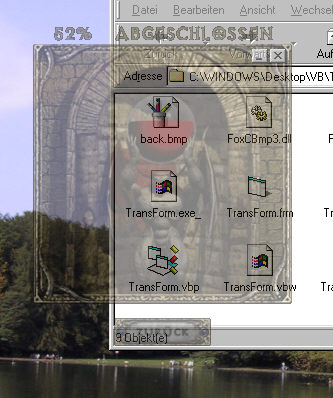

<div align="center">

## REAL Translucent Form, Flickerless & AutoUpdating


</div>

### Description

This Code shows <br>how to make real transparent forms without needing Win98 or W2k; it does not flicker and it automatically updates while moving. Even the Buttons are translucent! This code is another good example how to use my FoxCBmp3.dll, too, furthermore it demonstrates an alternative way to create cool effects with Buttons (like graphics, transparency, mask...)
 
### More Info
 


<span>             |<span>
---                |---
**Submitted On**   |2001-03-04 14:52:08
**By**             |[Florian Egel](https://github.com/Planet-Source-Code/PSCIndex/blob/master/ByAuthor/florian-egel.md)
**Level**          |Intermediate
**User Rating**    |4.8 (126 globes from 26 users)
**Compatibility**  |VB 4\.0 \(32\-bit\), VB 5\.0, VB 6\.0
**Category**       |[Graphics](https://github.com/Planet-Source-Code/PSCIndex/blob/master/ByCategory/graphics__1-46.md)
**World**          |[Visual Basic](https://github.com/Planet-Source-Code/PSCIndex/blob/master/ByWorld/visual-basic.md)
**Archive File**   |[CODE\_UPLOAD15885342001\.zip](https://github.com/Planet-Source-Code/florian-egel-real-translucent-form-flickerless-autoupdating__1-21497/archive/master.zip)

### API Declarations

```
FoxAlphaBlend
BitBlt
GetDesktopWindow
GetDC
ReleaseDC
Sleep
```


